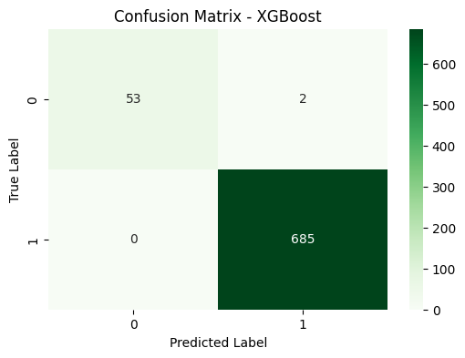

# Model Card: Binary Classification

## Model Details
- **Model Name:** XGBoost Classifier
- **Model Version:** v1.0
- **Model Date:** 2025-07-05
- **Model Type:** Binary Classification
- **Algorithm:** XGBoost (Extreme Gradient Boosting)



Confusion matrix on a random 20% test bench.

## Training Data
- **Data Sources:** The model was trained on data combined from two CSV files: `data/Training_part1.csv` and `data/Training_part2.csv`. These files were merged based on a common `id` column.
- **Data Preprocessing:**
    - **Consolidation:** The two source CSV files were merged on the `id` column.
    - **Duplicate Removal:** Duplicate rows were removed from each dataset before merging.
    - **Feature and Target Separation:** The 'Class' column was identified as the target variable (y), and the 'id' column was dropped from the features (X).
    - **Train-Test Split:** The data was split into training (80%) and testing (20%) sets, stratified by the target variable 'Class' (random_state=42).
    - **Missing Value Imputation:**
        - Numerical features: Missing values were imputed using the mean strategy.
        - Categorical features: Missing values were imputed with the constant string 'missing'.
    - **Categorical Feature Encoding:** Categorical features were transformed using One-Hot Encoding. Unknown categories encountered during transformation are ignored.
    - **Numerical Feature Scaling:** Numerical features were scaled using StandardScaler.
    - The fully preprocessed dataset (train and test combined with a 'split' indicator) is saved in Parquet format at `data/preprocessed_data.parquet`. *Note: This file is not checked into version control but can be reproduced by running `1_consolidate_data.ipynb`.*

## Model Training
- **Training Procedure:** The XGBoost model (xgb.XGBClassifier) was trained on the preprocessed training data (scaled numerical features, one-hot encoded categorical features). The `scale_pos_weight` parameter was calculated based on the class distribution in the training set to handle potential class imbalance. The model was fit using `X_train_scaled` and `y_train`.

- **Key Decisions:**
    - **Baseline Model Comparison:** A Logistic Regression model was trained and evaluated as a baseline (see `2_baseline.ipynb`). This provides a benchmark for the performance of more complex models.
    - **Choice of Algorithm:** XGBoost was chosen for its robust performance and ability to handle various data types and potential imbalances.
    - **Cross-Validation Strategy:** Stratified K-Fold cross-validation (5 splits, shuffle=True, random_state=42) was used to evaluate model performance more robustly, ensuring class proportions are maintained in each fold. This was initially demonstrated with a Logistic Regression model (see `3_cross_validation.ipynb`) and used for evaluating the final calibrated XGBoost model (see `5_xgboost_calibration.ipynb`).
    - **Calibration:** The XGBoost model's probabilities were calibrated using Isotonic Regression (`CalibratedClassifierCV` with `method='isotonic'` and internal cv=5). This was chosen after comparing with Platt Scaling. An optimal classification threshold of 0.85 was then determined for the calibrated model to maximize the F1-score for Class 0 (negative class). The calibrated model and its metadata (including the optimal threshold) are saved in `data/calibrated_xgb_isotonic_model.joblib` and `data/calibrated_xgb_isotonic_model_metadata.json` respectively (see `5_xgboost_calibration.ipynb`).
    

## Evaluation
- **Metrics (on the test set, using Isotonic Calibrated XGBoost with optimal threshold 0.85):**
    - **Accuracy:** 0.9973
    - **ROC AUC Score:** 0.9874
    - **Classification Report:**
        - Class 'n' (0 - negative class):
            - Precision: 1.00
            - Recall: 0.96
            - F1-score: 0.98
            - Support: 55
        - Class 'y' (1 - positive class):
            - Precision: 1.00
            - Recall: 1.00
            - F1-score: 1.00
            - Support: 685
    - **Confusion Matrix:**
      ```
      [[53  2]  (TN, FP)
       [ 0 685]] (FN, TP)
      ```
- **Evaluation Data:** The model was evaluated on the test set (20% of the data from `data/preprocessed_data.parquet`), which was held out and not used during training or calibration hyperparameter tuning.
- **Performance:** The Isotonic calibrated XGBoost model, with an optimized threshold of 0.85, demonstrates excellent performance on the test set. It achieves high accuracy and ROC AUC. Notably, it has perfect precision and recall for the majority class ('y') and very high precision and recall for the minority class ('n'), indicating strong predictive capability for both classes. The feature importance analysis (see `6_xgboost_evaluation.ipynb`) provides insights into which features contribute most to the predictions.

## Caveats and Recommendations
- **Limitations:**
    - The model's performance is contingent on the quality and representativeness of the training data.
    - Feature importance (from `6_xgboost_evaluation.ipynb`) indicates feature contributions but doesn't fully explain complex interactions.
    - The `n_estimators` hyperparameter was noted as potentially tunable; further hyperparameter optimization could yield improvements.
    - The model was trained on a relatively small dataset (approx. 3700 samples after preprocessing).
- **Monitoring:**
    - Regularly monitor input data drift and concept drift.
    - Track key performance metrics (Accuracy, F1-score for minority class, ROC AUC) on new data.
    - Re-calibrate and potentially re-train the model if performance degrades significantly.
- **Future Work:**
    - Conduct a more thorough hyperparameter tuning process (e.g., using GridSearchCV or RandomizedSearchCV with the chosen cross-validation strategy). Some GridSearch was run, but it did not yield significant improvements over the default XGBoost configuration, likely because the model was already very performant, leaving little room for improvement with this dataset and feature set.
    - Explore more advanced feature engineering techniques. Consider feature selection to potentially simplify the model or re-evaluate the need for imputation by dropping features with high missingness.
    - Re-evaluate the necessity of imputation for XGBoost, as it handles missing data natively. Imputation might be detrimental in production if missingness encodes intrinsic information. This requires further evaluation before production deployment.
    - Re-evaluate the impact of numerical scaling (StandardScaler). While included here for baseline comparison, it's not strictly necessary for XGBoost and could potentially have a negative effect. Further exploration is recommended.
    - Evaluate other classification algorithms or ensemble methods for comparison.

## How to Use
- **Input:** The model expects input features that have undergone the same preprocessing steps as the training data (mean imputation for numerical, 'missing' imputation for categorical, one-hot encoding for categorical, and StandardScaler for numerical features). The original features before preprocessing are listed in `1_consolidate_data.ipynb`. After preprocessing, there are 53 features. *Note: The preprocessing pipeline itself (e.g., the fitted `ColumnTransformer` from `1_consolidate_data.ipynb`) needs to be saved/exported alongside the model for consistent application in production. This step was omitted in this example.*
- **Output:** The model outputs a binary prediction (0 for 'n', 1 for 'y') for the 'Class' variable. It produces probabilities for each class, which are then thresholded using the optimal threshold (0.85 for P(Class=1)) determined during calibration to maximize the F1-score for Class 0.
- **Example Usage:** See `6_xgboost_evaluation.ipynb` for an example of loading the model and metadata to make predictions using the optimal threshold.


## Deployment Recommendations
Based on the evaluation and caveats, consider the following MLOps aspects for production deployment:
- **Confirm Business Need & Risk:** Ensure the high performance meets the specific business requirements and that the risks associated with the few misclassifications (2 False Positives, 0 False Negatives on the test set) are acceptable for the target application.
- **Data Contracts:**
    - Define and enforce static data contracts (schemas, types, value ranges, constraints) for:
        - **Raw Input Data:** Before the preprocessing pipeline.
        - **Preprocessed Data:** Output of the pipeline and input to the model.
        - **Model Predictions:** Output schema of the prediction service.
    - Implement validation checks against these contracts during training/batch inference and ideally in real-time during online inference to catch data quality issues early.
- **Export Preprocessing Pipeline:** The `ColumnTransformer` fitted in `1_consolidate_data.ipynb` must be saved (e.g., using `joblib`) alongside the model (`calibrated_xgb_isotonic_model.joblib`) and metadata (`calibrated_xgb_isotonic_model_metadata.json`) to ensure consistent feature transformation for new data.
- **Address Future Work Items:** Before full-scale deployment, strongly consider re-evaluating the imputation and scaling steps as noted in "Future Work", as these might be unnecessary or even detrimental for XGBoost in a production setting where missingness patterns could be informative.
- **Reproducibility & Traceability:**
    - **Environment:** Use `requirements.txt` to define dependencies. For stronger reproducibility, containerize the training and inference environments using **Docker**.
    - **Experiment Tracking:** Utilize tools (e.g., MLflow, Weights & Biases) to log parameters, metrics, code versions, and artifacts for each experiment run, ensuring traceability from data to model.
    - **Model Registry:** Store versioned model artifacts (model file, preprocessing pipeline, metadata, data contracts) in a model registry for controlled deployment and rollback capabilities.
    - **Version Control:** Use configuration files to collect all the constants related to the hyperparameters used.
- **Deployment Strategy:** Consider a phased rollout (e.g., shadow mode comparing predictions, canary release, or A/B testing) to compare performance against existing systems or the baseline model in a live environment before full traffic switchover.
- **Monitoring Infrastructure:** Implement robust monitoring for:
    - **Data Drift & Quality:** Track statistical distribution shifts and contract violations in input features.
    - **Concept Drift:** Monitor the relationship between features and the target variable.
    - **Model Performance:** Continuously evaluate key metrics (Accuracy, F1, ROC AUC, Confusion Matrix elements) on production data using ground truth when available.
    - **Calibration:** Periodically check if the model's probability outputs remain calibrated.
    - **Operational Metrics:** Monitor latency, throughput, error rates of the prediction service.
- **Retraining Strategy:** Define clear triggers (e.g., performance degradation below a threshold, significant data/concept drift detected) and an automated or semi-automated process for model retraining, validation, and deployment.
- **Metric evaluation:** Evaluate the latency p99 on the model and evaluate the memory usage to make sure the are no memory leaks. Also consider doing additional checks like sensitivity analysis to check that the model does not easily flip prediction with floating numbers changing.
